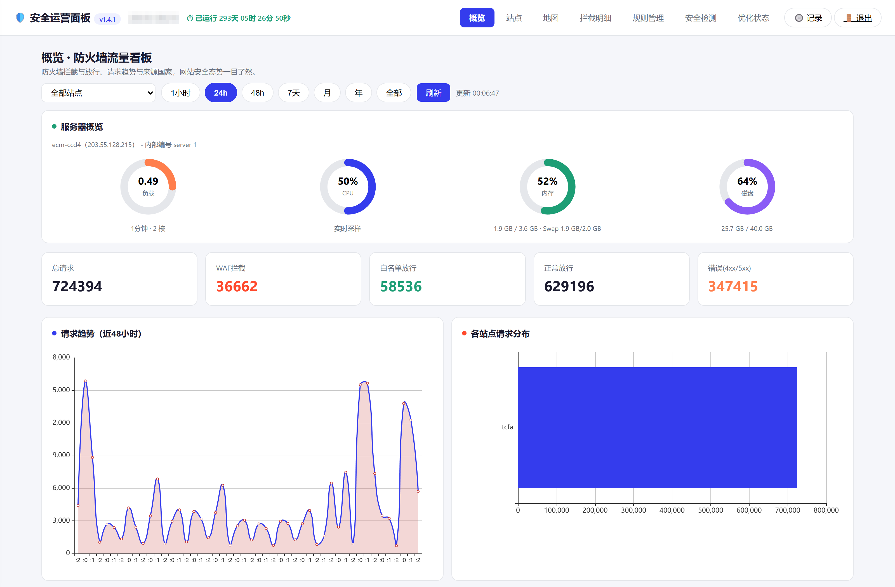
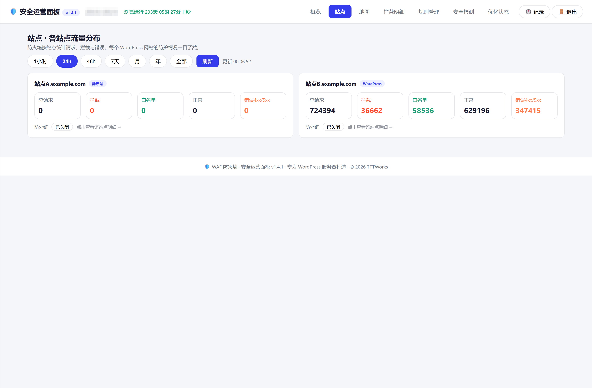
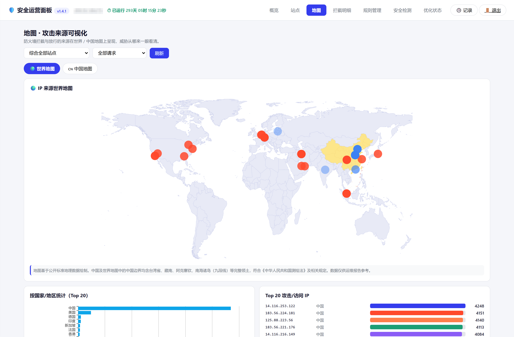
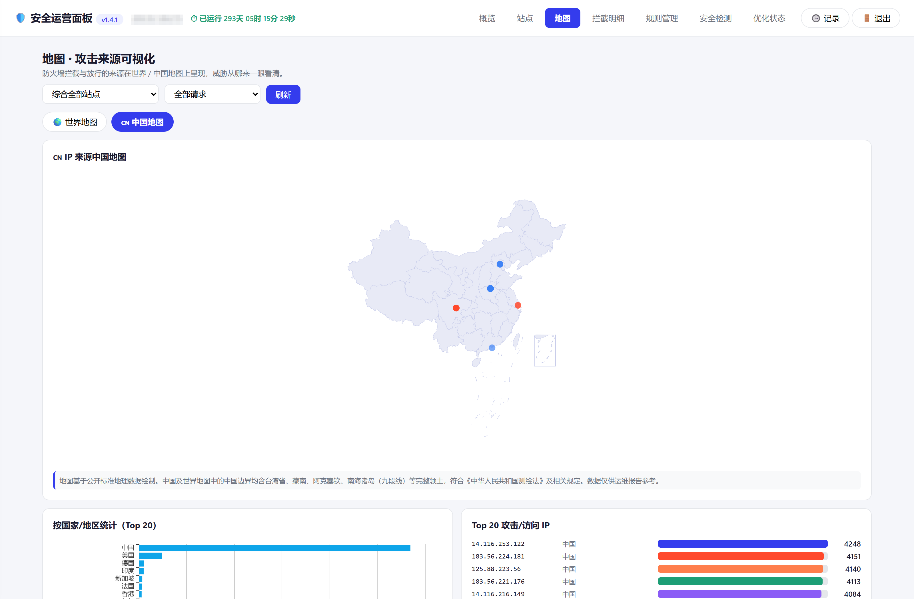

# ttt-waf-panel

> **为 WordPress 服务器打造的 nginx 层 WAF + 安全运营面板**
> 零外部依赖 · 零侵入 · 不误伤真人 · **兼容宝塔**

一个轻量的服务器安全运营面板：在 nginx 层用精确黑名单挡住恶意流量，再把全量请求送进一个可看、可筛、可追溯的面板里。

**不依赖任何重型 WAF 引擎**（不需要 Docker、不需要 Lua、不需要反向代理接管 80/443），一个 `map` 指令 + 一段 PHP + 一段 Python 就够了。

**目标是替代市面上收费的 nginx 防火墙** —— 把几种知名面板的长处取过来，把它们的痛点避开（取舍见[与同类方案的对比](#与同类方案的取舍)）。

---

## 为什么做这个

市面上的 WAF（尤其是容器化方案）在**小型多站点服务器**上有三个现实问题：

1. **重** —— 动辄 7 个容器、几百 MB 内存，还要求接管 80/443
2. **误伤真人** —— 基于规则评分的方案经常把正常用户挡在门外
3. **脆弱** —— 一旦它的内部组件（socket 挂载、detector 进程）出问题，**整站会跟着慢或挂**

真实的坑：某台服务器上 WAF 的 detector socket 因内核 + overlay2 的挂载传播问题变成孤儿 inode，
直连后端只要 **0.37s**，经过 WAF 却要 **20s** —— 重建、重启、升级版本都无效。

所以做了这个方案：**拦截决策留在 nginx（C 实现的 `map`，比脚本引擎快），只对明确的坏流量出手；其余全部放行并记录。**

---

## 特性

### 防护层（nginx）

- **精确黑名单**：恶意 UA、恶意路径、**查询串注入**（`file_put_contents` / `base64_decode` / `gzinflate` 等），字符串匹配而非评分 → **不误伤真人**
- **站点级防护**：`wp-login.php` 限流、`uploads/` 禁止执行 PHP、`xmlrpc.php` 403、`/wp-json/wp/v2/users` 403
- **SEO 爬虫限流**：AhrefsBot / meta-externalagent 等按常量键限速，正常用户用唯一键（零误伤）
- **防外链开关**：按站点开启，图片/媒体 `valid_referers` 防盗链
- **fail2ban 集成**：登录爆破封禁 + jail 状态回显

### 数据管道

```
nginx access_log (waf_full 格式，带 $rule_hit 标记)
   │  cron 每 2 分钟增量
   ▼
ingest.py  ← GeoIP 富化（geoip2 + GeoLite2）
   │
   ▼
SQLite (waf.db)  ← 全量请求 + 规则命中标记
   │
   ▼
api.php  →  index.html（单页前端）
```

- **增量采集**：记录文件偏移，只读新增部分
- **站点白名单**：只收录你的站，扫描器伪造的 Host（`checkip.amazonaws.com` 等）自动丢弃
- **纯 IP 直连流量**自动跳过，不污染站点列表

### 面板

| 页面 | 内容 |
|---|---|
| **概览** | 请求总量 / 拦截数 / 白名单数、按小时趋势、规则分布、**世界地图**（合规中国边界）、国家 Top20、服务器四环（负载/CPU/内存/磁盘） |
| **站点** | 各站请求与拦截、类型识别（WordPress/静态/自定义）、发信栈探测（SMTP 插件 / 表单组件 / 防垃圾 / WP Mail Guard）、防外链开关 |
| **地图** | 🌍 世界地图 / 🇨🇳 中国地图一键切换，IP 来源地理分布 + Top 20 攻击来源（[见下节](#地图合规的中国边界本项目的重要设计)） |
| **拦截明细** | 全量请求列表，按站点 / 规则 / 时间 / IP 筛选 |
| **规则管理** | 用户规则文件在线编辑 + 主配置只读查看 |
| **优化状态** | **检测并展示** OPcache / Memcached / **Redis**（原生 RESP 协议，**不依赖 PHP 扩展**）/ BBR / Swap / MySQL 的当前状态，支持**一键清除缓存**。⚠️ **只做检测与清理，不含组件安装或参数调优**（见下方说明） |
| **安全检测** | 综合报告 · 安全风险扫描 · **恶意文件检测**（启发式 + 病毒库元数据，**只检测定位、绝不自动删除**）· **网站漏洞检测**（WPScan API）· **服务器安全巡检**（SSH 配置 / 开放端口 / 待装更新 / rootkit 痕迹） |

> ⚠️ **关于「优化状态」页的边界（重要）**
>
> 它**只做检测与展示**，外加一个「一键清除缓存」。**不含任何组件的安装、调优或参数修改。**
>
> 面板会告诉你：OPcache 装没装 / 命中率多少、Memcached 与 Redis 有没有在跑 / 内存用了多少、BBR 是否已开启、
> Swap 分配了多少、MySQL 的关键参数是什么……
>
> **但它不会替你装 OPcache、不会替你调 `php-fpm` 子进程数、不会替你开 BBR、不会替你改 MySQL 配置。**
> 这些动作直接改生产参数，在错的机器上执行就是事故。**用什么组件、开到多大 —— 由你判断、由你执行；面板只负责告诉你现状。**
> （同理，「恶意文件检测」也只检测定位、**绝不自动删除**。）

### 界面预览

**概览** —— 拦截态势、请求趋势、来源国家一屏可见：



**站点** —— 逐站请求与拦截、类型识别（WordPress / 静态 / 自定义）、发信栈探测：



> 截图取自一台**生产环境**面板（对页眉服务器标识做了打码、站点名以占位名替换）。

### 工程取向

- **零外部依赖**：ECharts 本地内置，**前端零 CDN 外链**（无 Google Fonts、无 CDN jQuery）
- **登录鉴权**：`login.php` + bcrypt + cookie 7 天 + IP 失败 5 次锁 15 分钟 + 登录日志地理定位
- **移动端适配**：断点 1024 / 767，抽屉菜单，图表自适应
- **部署简单**：单文件 `api.php` + 单文件 `index.html`，改完即生效（no-store 禁缓存）
- **不进库的敏感数据**：密码哈希、会话、流量库、GeoIP 库全部在 `.gitignore` 之外

---

## 地图：合规的中国边界（本项目的重要设计）

> 大多数开源仪表盘、以及几乎所有境外地图方案，在中国地图这件事上是**错的** —— 漏绘南海九段线、藏南划归印度、台湾单独着色。这类图在国内公开发布，**可能触犯《地图管理条例》**。

本项目的做法：

| 设计 | 说明 |
|---|---|
| **纯本地渲染** | ECharts（Apache-2.0，随项目内置）+ 本地 GeoJSON。**不调用任何在线地图服务** —— 没有 OpenStreetMap、没有 Google/ArcGIS 瓦片、没有任何外部地图请求，前端零 CDN 外链 |
| **世界地图 · China 边界按国标** | `lib/world_cn.json` 中**中国部分的边界已替换为 DataV 官方边界**，涵盖藏南、阿克塞钦、南海 |
| **九段线独立叠加** | 世界地图上**单独绘制南海九段线** —— 从中国 GeoJSON 的 `adcode = 100000_JD` 要素提取边界环，以红线叠加。**这正是多数方案直接漏掉的部分** |
| **中国地图模式** | 一键切换「🌍 世界地图 / 🇨🇳 中国地图」，中国视图只统计 `CN / HK / MO / TW` 来源 IP |

**世界地图**（500 个来源点，红线即九段线）：



**中国地图**：



### 合规说明（请读完）

- 本项目**提供的是渲染代码，不是地图服务** —— 不托管瓦片、不代理地图请求、**不随仓库分发地图数据**（数据由使用者自行获取，见 [`DATA.md`](DATA.md)）
- **不引入任何境外地图服务**，从架构上规避「使用不合规底图」的风险
- ⚠️ **但请注意**：若你要把面板**以公网服务形式对外展示**，其展示的地图内容仍应按当地法规自行确认合规性（例如使用具备测绘资质的底图服务，或确保边界数据来源合规）
- 本项目不构成法律意见

---

## 环境要求

| 组件 | 要求 | 说明 |
|---|---|---|
| Linux | 任意主流发行版 | 已在 CentOS 7 / 8、Ubuntu 22.04 / 24.04 / 26.04 上运行 |
| nginx | 1.20+ | 宝塔编译版或系统 apt 版**都支持**（代码内置双路径探测） |
| PHP | 8.x | 必需扩展：`pdo_sqlite`、`mbstring`、`curl`、`json` |
| Python | 3.8+ | 需要 `geoip2` 模块 |
| SQLite | 任意 | 随 PHP 的 pdo_sqlite 提供 |
| fail2ban | 可选 | 装了会显示 jail 状态，没装也不影响 |

> **宝塔用户注意**：宝塔 nginx **不带** `lua` 和 `auth_request` 模块 —— 本项目**不需要**这两个，全部功能用原生 `map` / `limit_req` / `internal` 实现。

---

## 与同类方案的取舍

> 下面有一段是**我们主动选择不做的事** —— 因为做错了会伤到真实用户。

| | **本面板** | 雷池（SafeLine） | 宝塔 nginx 防火墙 |
|---|---|---|---|
| 形态 | nginx 原生 `map` + PHP 面板 | Docker 多容器 + 反向代理接管 80/443 | 宝塔插件（订阅制） |
| 部署成本 | 一份配置 + 几个 cron | 需 Docker、较多内存、接管端口 | 面板内安装，但强依赖宝塔 |
| 判断方式 | **精确黑名单**（UA / 路径 / 查询串） | 规则评分 / 语义检测 | 规则库（相对黑盒） |
| 误伤真人 | **极少**（字符串精确匹配，非评分） | 存在（评分阈值） | 存在 |
| 拦截可追溯 | ✅ 全量请求 + 逐条明细 + 规则命中标记 | ✅ | 部分 |
| 外部依赖 | **零**（无 Docker / 无 Lua / 无 composer） | Docker | 宝塔面板 |
| 面板门槛 | 8089 独立面板，登录即可看 | 独立面板 | 面板内 |
| 费用 | **开源免费**（Apache-2.0） | 免费版 + 商业版 | 订阅 |

### 我们主动放弃的能力（诚实交代）

- **不做智能评分 / 语义分析** —— 宁可漏掉一部分可疑请求，也不误封真人。拿不准的交给上层（WordPress 的验证码 / 反垃圾插件）处理
- **不做 POST body 检查** —— nginx 原生查不了 body；硬上 Lua 会引入依赖与开销，且极易误伤正常表单提交
- **不做人机验证（JS 挑战）** —— 需要额外服务与前端改造，收益与复杂度不匹配
- **没有云端威胁情报** —— 规则完全本地、可读、可改（面板里就能改）
- **不做"一键安装 / 一键优化"** —— 面板**只如实展示现状**（OPcache 命中率、Swap 用量、BBR 是否开启、Redis 连接数与内存占用、MySQL 参数……）并允许一键清缓存；**它不会替你装 OPcache、不会替你调 `php-fpm` 进程数、不会替你开 BBR**。这些动作直接改生产参数，在错误的机器上执行就是事故 —— **用什么组件、开到多大由你决定，面板只负责告诉你现在是什么样**
- **不做"全自动部署"** —— 见下节

### 为什么用 nginx `map` 而不是 Lua / 反向代理

- `map` 是 **C 实现的哈希表**，匹配开销极低，不引入任何新引擎
- 拦截决策留在 nginx，**不增加网络跳数**（反代式方案每个请求都要多一次转发）
- 宝塔自带的 nginx **不含** `lua` 模块，换 OpenResty 需重装并逐站排查兼容性 —— 代价大于收益

---

## 部署须知（需要动手能力）

> **本项目不是一键安装的产品，是给懂服务器的人用的工具。**
> 它要改你的 nginx 配置、加 cron、动 PHP —— 这些动作在任何生产环境都需要判断力。

**前置能力**

- 看得懂 nginx 配置、跑得通 `nginx -t`
- 知道自己的 PHP socket 路径与日志目录
- 愿意"先在一台机器上试，再铺开"

**可以借助 AI 完成**

把本仓库交给一个 AI 助手（Claude / ChatGPT / WorkBuddy 等），告诉它你的环境（宝塔还是系统 nginx、PHP 版本、站点目录、日志路径），让它**按你的实际环境**生成三份配置与 cron —— 通常比手抄文档更快、更少出错。

`README.md` + `install.sh` + `DATA.md` 就是为此准备的：三份一起给 AI，它基本能带你走完。

**关于技术支持**

本项目**不提供免费的部署指导或代部署服务**。仓库里的文档、`install.sh` 的检查项、以及下面的 FAQ 已覆盖绝大多数坑；如果你评估后需要有人帮你落地，可联系作者商谈。

---

## 快速开始（概要）

```bash
# 1) 放到面板目录
mkdir -p /www/wwwroot/wafpanel
cp -r ttt-waf-panel/* /www/wwwroot/wafpanel/

# 2) 生成面板密码（在服务器上执行，避免哈希里的 $ 被 shell 展开）
php -r 'file_put_contents("/www/wwwroot/wafpanel/panel.passwd", password_hash("你的密码", PASSWORD_BCRYPT));'
chown www:www /www/wwwroot/wafpanel/panel.passwd && chmod 600 /www/wwwroot/wafpanel/panel.passwd
#   ↑ 属主必须是 php-fpm 的运行用户：宝塔是 www，Ubuntu 系是 www-data

# 3) 本机标识
cp server_identity.example.json /www/wwwroot/wafpanel/server_identity.json
#   编辑 no / ip 两项

# 4) 采集站点白名单（★ 必改，不改面板里永远是 0 条）
cp ingest.py /www/wwwroot/wafpanel/
vi /www/wwwroot/wafpanel/ingest.py
#   SITES = ('你的站点短名',)    ← 去 www、取首个点前的段，如 www.example.com → 'example'

# 5) 下载两个数据文件（许可原因不随仓库分发，见 DATA.md）
#    GeoLite2-City.mmdb  +  lib/china.json / lib/world_cn.json

# 6) nginx 配置
#    面板站点：把 wafpanel.conf 放到 conf.d/ 或宝塔 vhost 目录，改 fastcgi_pass 的 socket 路径
#    全局规则：把 waf_protect.conf 放到 nginx conf 目录，并在 nginx.conf 的 http{} 里 include 它
#    站点接入：把 waf_intercept.conf 放进站点的 extension 目录，在 vhost 里 include
nginx -t && nginx -s reload

# 7) 定时任务（7 条）
crontab -e
```

需要的 cron（`{PY}` 为 Python 路径：宝塔用 `/www/server/panel/pyenv/bin/python3`，系统用 `/usr/bin/python3`）：

```cron
*/2 * * * * {PY} /www/wwwroot/wafpanel/ingest.py
*/1 * * * * bash /www/wwwroot/wafpanel/reload_nginx.sh
*/1 * * * * {PY} /www/wwwroot/wafpanel/fail2ban_dump.py
*/5 * * * * {PY} /www/wwwroot/wafpanel/login_log_geo.py
30 2 * * * {PY} /www/wwwroot/wafpanel/scan.py      >> /www/wwwroot/wafpanel/scan.log 2>&1
35 2 * * * {PY} /www/wwwroot/wafpanel/sys_check.py >> /www/wwwroot/wafpanel/sys_check.log 2>&1
40 2 * * * {PY} /www/wwwroot/wafpanel/vuln_scan.py >> /www/wwwroot/wafpanel/vulnscan.log 2>&1
```

**验证**

```bash
nginx -t                                   # 语法
curl -s -o /dev/null -w '%{http_code}\n' http://127.0.0.1:8089/                          # 200
curl -s -o /dev/null -w '%{http_code}\n' 'http://127.0.0.1:8089/api.php?action=version'  # 200（*不需要登录*，可据此判断 PDO 是否正常）
# 恶意 UA 与恶意路径应 403：
curl -s -o /dev/null -w '%{http_code}\n' -A 'sqlmap' https://你的站/
curl -s -o /dev/null -w '%{http_code}\n' https://你的站/xmlrpc.php
```

> ⚠️ 云服务器还需要在**云控制台安全组**放行面板端口（默认 8089）；宝塔安装会自动启用 UFW/firewalld，也要放行。

---

## 需要自行下载的数据（★ 重要）

因许可限制，以下文件**不随仓库分发**，请按 [`DATA.md`](DATA.md) 获取：

| 文件 | 放置位置 | 用途 | 许可 |
|---|---|---|---|
| `GeoLite2-City.mmdb` | 面板根目录 | IP → 国家/城市 | MaxMind EULA（**禁止再分发**） |
| `lib/china.json` | `lib/` | 中国地图轮廓 | 阿里 DataV（见来源条款） |
| `lib/world_cn.json` | `lib/` | 世界地图轮廓 | 同上 |

> 不下载也能跑：只是**世界地图为空、国家统计显示「未知」**，其余功能不受影响。

---

## 配置说明

| 配置文件 | 作用 | 注意 |
|---|---|---|
| `panel.passwd` | 面板密码（bcrypt 哈希） | **属主必须是 php-fpm 运行用户**，否则登录永远报「密码错误」 |
| `server_identity.json` | 本机标识（`{"no":"server 1","ip":"..."}`） | 未配置时回退为「主机名（IP）」 |
| `site_alias.json` | 站点显示别名（目录名 → 公网域名） | 目录名与域名不一致时用；复制 `site_alias.example.json` 改 |
| `ingest.py` 的 `SITES` | **站点白名单** | ★ 每个新站点都要加，否则该站数据全被丢弃 |
| `waf_rules_user.conf` | 用户自定义 WAF 规则 | 面板「规则管理」页可在线编辑 |
| `wpscan_token.json` | WPScan API Token | 面板「网站漏洞检测」页填写 |

---

## 目录结构

```
ttt-waf-panel/
├── api.php                  # 后端 API（单文件，含 Redis RESP 客户端）
├── index.html               # 前端单页（ECharts 图表 + Leaflet 地图）
├── login.php                # 登录页（bcrypt + cookie session + 防爆破）
│
├── ingest.py                # 日志采集：waf_full.log → GeoIP → SQLite
├── fail2ban_dump.py         # fail2ban jail / 站点状态 → JSON
├── login_log_geo.py         # 登录日志地理定位
├── scan.py                  # 恶意文件启发式扫描
├── vuln_scan.py             # WPScan 漏洞检测
├── sys_check.py             # 系统安全巡检
├── gen_site_status.py       # 站点状态生成（非宝塔机用）
├── reload_nginx.sh          # root cron：处理规则变更并 reload nginx
│
├── waf_protect.conf         # nginx 全局规则（map / zone / limit）
├── waf_intercept.conf       # 站点级接入片段
├── waf_rules_user.conf      # 用户自定义规则
├── wafpanel.conf            # 面板站点 vhost（8089）
│
├── lib/echarts.min.js       # ECharts（本地内置，零 CDN）
│   └── china.json / world_cn.json   ← 需自行下载
│
├── data/                    # 需自行下载的数据（见 DATA.md）
├── site_alias.example.json
├── server_identity.example.json
├── DATA.md                  # 数据下载引导
├── THIRD-PARTY-NOTICES.md   # 第三方许可声明
└── LICENSE                  # Apache-2.0
```

---

## 常见问题

**Q：面板里站点数据一直是 0，但日志文件在涨？**
`ingest.py` 的 `SITES` 白名单不对。它对 `host` 去掉 `www.` 后取首个点前的段做精确匹配 —— 填 `example.com` 是不行的，要填 `example`。
排查命令：

```bash
tail -3000 /www/wwwlogs/waf_full.log | awk -F'|' '{print $3}' | sed 's/"//g; s/^www\.//' | cut -d. -f1 | sort | uniq -c | sort -rn
```

**Q：首页打得开，但接口全 500？**
PHP 缺 `pdo_sqlite` 扩展。`php -m | grep pdo_sqlite` 检查；Ubuntu 系 `apt install php8.x-sqlite3`。
判断技巧：`api.php?action=version` **不需要登录**，它返回 200 就说明 PHP + PDO 正常。

**Q：面板首页 403，但 `/index.html` 和 `/api.php` 都 200？**
vhost 的 `index` 指向了不存在的 `index.php`（面板前端是纯静态 html）。改成：

```nginx
index index.html;
location / { try_files $uri $uri/ /index.html; }
```

**Q：数据从某天起不再更新？**
很可能日志被 logrotate 轮转，而 `ingest.py` 的偏移逻辑只在主文件上推进。当前主文件为 0 字节、内容都在 `.1` 里时会空转退出。
处理：把 logrotate 配成 `copytruncate`，或让 `ingest.py` 支持轮转回读。

**Q：页面缓存导致「改了配置看不到变化」？**
`wafpanel.conf` 里已加 `Cache-Control: no-store`；如果还不对，检查是否有 CDN 或浏览器强缓存。

**Q：Redis 卡片显示「未运行」但我确实装了 Redis？**
本项目的 Redis 采集**不依赖 PHP `redis` 扩展** —— 直接走原生 RESP 协议读 `INFO`。若显示未运行，先确认 `127.0.0.1:6379` 可达、且未设置 `requirepass`。

**Q：登录一直报「密码错误」？**
`panel.passwd` 的**属主**是否是 php-fpm 的运行用户（宝塔 `www`、Ubuntu `www-data`）+ `chmod 600`。属主是 root 时 php-fpm 读不到文件。
改哈希一律在机内生成：`php -r 'file_put_contents("...panel.passwd", password_hash("新密码", PASSWORD_BCRYPT));'` —— 不要把带 `$` 的 bcrypt 字符串塞进 `bash -c "..."`（`$` 会被展开）。

---

## 安全说明

- 面板默认监听 **8089**，请**务必**：① 在云安全组放行时**尽量限定来源 IP** ② 使用强密码
- 面板对业务接口有登录鉴权；未登录访问 `overview` / `sites` 等返回 `401 {"error":"unauthorized"}` 属**正常行为**
- `panel.passwd`、`waf.db`、`sessions/`、`GeoLite2-City.mmdb` 均已在 `.gitignore` 中 —— **请勿提交到任何仓库**
- 恶意文件扫描为**启发式**，存在误报/漏报，请作运维参考而非唯一依据

---

## 开发说明

- 后端零框架、零 composer 依赖，纯 PHP 原生 + PDO
- 前端零构建、零打包工具，直接 `index.html`
- 单文件是为了**部署极简**（改完上传即生效）；代价是文件偏长 —— 接受这个权衡
- 修改后请务必：`php -l api.php` 语法检查 → `curl 'api.php?action=version'` 验证 → 登录态验证 `action=overview`

---

## 作者

**Aloysius Luo** · [TTTWorks](https://tttworks.com)

## 许可

[Apache License 2.0](LICENSE) —— 允许商用、修改、分发，需保留版权与许可声明。
第三方组件许可见 [`THIRD-PARTY-NOTICES.md`](THIRD-PARTY-NOTICES.md)。
